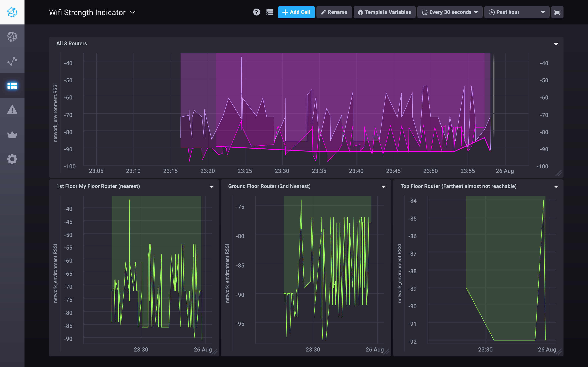

# esp8266-triangulation
An newbie approach for esp8266 triangulation 

### Dump the code to esp8266 (any would work)

### `Run docker-compose up` to start the servers
      > PORT 8086 Influx
      > http://localhost:3001 Chronograf

# Happy Monitoring network environment around you :nerd_face: 

A Chronogrpah Screenshot 

